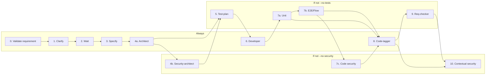

# Complete Development (full flow + unit + E2E + security loop)

Execute the full development flow for the requirement indicated in `$ARGUMENTS` (for example: `RQ-002-editar-tarefa`), **without human intervention in the test loop**, as described below. The flow can run **without security agents** or **without test agents** when optional flags are provided (see Parameters section). **When `--no-security` is not used**, security agents must be used whenever needed and appropriate. At minimum, static code security (step 7c) is **mandatory** for all feature development.

## Parameters

When invoking the command, the agent must interpret `$ARGUMENTS` as a token list (space-separated). The **first token** is always the requirement ID. The others may be optional flags.

- **requisite-id** (required): first argument. Requirement ID (for example: `RQ-002-editar-tarefa`).
- **--no-security** (optional): when present, do not execute security steps or security agents (4b, 7c, 10, and contextual security agents).
- **--no-tests** (optional): when present, do not execute test steps or test agents (5 test-plan, 7a unit, 7b flow/robot, 9 req-checker).

Flags can be combined (for example: `--no-security --no-tests`). Token order after `requisite-id` is irrelevant.

## Document & Clear (required after each step)

After **each flow step** (0, 1, 2, 3, 4a, 4b, 5, 6, each relevant iteration of 7, 8, 9, 10), the agent must apply **"Document & Clear"** to prevent context loss and keep focus in long-running tasks.

**Progress file**: `.opencode/docs/requirements/{req-id}/progress.md` (replace `{req-id}` with the requirement ID, for example: `RQ-002-editar-tarefa`).

### How to execute Document & Clear

1. **Document**: when the current step is completed, the agent must **update** `progress.md` with:
   - **Requirement**: requirement ID.
   - **Completed step**: which step was just executed (for example: `3. Specify`).
   - **Current state**: summary of what was produced (created/changed files, decisions, generated artifacts).
   - **Next step**: which step to execute next (for example: `4a. Architect`).
   - **Required context to continue**: code excerpts, file paths, agent conclusions (product-owner, security-architect, etc.) needed by the next step. Links to requirement docs/specs.
   - **Notes**: blockers, pending user actions (for example: "waiting for clarification completion"), remaining iteration limit in loop 7, etc.

2. **Clear**: the agent must **inform the user** to run **`/clear`** to clear chat history and reset the context window.

3. **Continue**: the agent must **inform the user** that, in the new session, they should ask the agent to continue with an instruction like: *"Read `.opencode/docs/requirements/{req-id}/progress.md` and continue the complete-development flow from the next indicated step."*

**Exceptions**: Document & Clear is not required **mid-step** (for example, in the middle of a 7a/7b/7c cycle). Apply Document & Clear when **finishing** each main step (or when exiting a full loop-7 iteration before step 8). Step 2 ("Wait for clarification completion") is a natural pause: document and request `/clear` before waiting. When resuming, the user confirms completion and the agent reads `progress.md` and continues at step 3.

### Suggested `progress.md` structure

```markdown
# Progress: Complete Development: {req-id}

## Completed step
{for example: "1. Clarify (product-owner)"}

## Current state
- Generated artifacts: ...
- Main files: ...
- Relevant decisions / conclusions: ...

## Next step
{for example: "2. Wait for user to complete clarifications"}

## Context to continue
- Paths: ...
- Required snippets or summaries: ...

## Notes
- ...
```

## Flow order

0. **Validate requirement**  
   Use the **validate-requirement** skill (`.opencode/skills/validate-requirement/SKILL.md`). Before starting Clarify, the agent must **validate** whether the requirement content (document under `.opencode/docs/requirements/{req-id}/`, e.g. `{req-id}.md` or `{req-id}-revised.md`) qualifies as **one** requirement according to `.opencode/docs/requirements/README.md`.  
   - **If valid**: proceed to step 1 (Clarify).  
   - **If it does not qualify or should be split**: **stop** the flow. Report to the user with justification and a split suggestion in format **RQ_XXX_01**, **RQ_XXX_02**, **RQ_XXX_NN** (or suggest rewrite). Do not proceed to step 1. When the user creates split requirements, for **each one** the agent must **ask user permission** before clarification. Only after authorization execute step 1 (Clarify) for that requirement.

1. **Clarify (product-owner)**  
   Use the **clarify-requirement** skill (`.opencode/skills/clarify-requirement/SKILL.md`). Use **product-owner** (`.opencode/agents/general/product-owner.md`) in CLARIFY mode to run requirement *clarify*: raise questions, risks, and details to be defined, and record clarifications in `.opencode/docs/requirements/{req-id-name}/{req-id}-clarifications.md` (or numbered version). Do not overwrite existing clarification files. Do not create the specification in this step.

2. **Wait for user clarification completion**  
   After *clarify*, **pause and wait** for the user to review and complete the clarification file generated/updated in the previous step.  
   Only proceed after the user confirms they completed/adjusted clarifications.

3. **Specify (product-owner)**  
   Use the **specify-requirement** skill (`.opencode/skills/specify-requirement/SKILL.md`). Use **product-owner** (`.opencode/agents/general/product-owner.md`) in SPECIFY mode to transform the clarified requirement into a detailed functional specification: read requirement (or `{req-id}-revised.md`) and completed clarifications (highest numbered if applicable), synthesize, and write `.opencode/docs/requirements/{req-id-name}/{req-id}-complete-requirement.md`. Optionally update `.opencode/docs/specs/` per project standard. Clarifications file must exist with all questions answered.

4a. **Architect**  
   Use the matching architecture agent (**backend-architect** or **frontend-architect**, depending on requirement) to generate the technical specification (tech-spec) based on the complete requirement document (`{req-id}-complete-requirement.md`), clarifications, specify output, and project context.

4b. **Architecture security review by security-architect (required)**  
   **Skip if** `--no-security`.  
   After tech-spec is generated in step 4a, use **security-architect** (`.opencode/agents/security/architecture/`) to analyze the technical plan from a security perspective: threat modeling (for example STRIDE), attack surface, trust boundaries, and systemic risks. Security-architect must consider tech-spec, sensitive endpoints/data, and architecture decisions.  
   - **If Critical or High architectural risks exist**: document recommended mitigations (for example in `.opencode/docs/requirements/{req-id}/security-architecture-review.md` or in the tech-spec itself). **re-invoke architect** (backend-architect or frontend-architect) with those recommendations to update tech-spec. Then re-run **security-architect** for validation.  
   - **When there is no Critical/High** (or after adjustment): proceed to step 5 (test-plan).  
   This ensures security issues are addressed at design time before implementation, while step 7c (code security) still validates implementation.

5. **Test-plan**  
   **Skip if** `--no-tests`.  
   Use **test-plan** to generate Gherkin test plans (`.feature`) or Robot Framework (`.robot`) from `{req-id}-complete-requirement.md`, clarifications, and specs in `.opencode/docs/requirements/{req-id}/` and `.opencode/docs/specs/`. `.feature`/`.robot` files must be created in `.opencode/docs/requirements/{req-id}/tests/planoTeste/`. This allows robot-tester and flow-test to run defined scenarios in the E2E loop.

6. **Developer**  
   Use the matching development agent (**backend-developer** or **frontend-engineer**) to implement the requirement according to the tech-spec (branch, implementation, commit. PR optional depending on project).

7. **Developer ↔ Tests (unit + E2E) + Code Security loop (until all pass or 5-iteration limit)**  
   **Conditionals**: If **--no-tests**: do not run 7a or 7b. Run only 7c (security), unless **--no-security** is also present (in that case skip all step 7 and go from Developer to step 8). If **--no-security**: run only 7a and 7b. Do not run 7c. If **--no-security** and **--no-tests** are both present: skip step 7 entirely (Developer -> step 8 Code-tagger).

   - **7a. Unit tests (unit-test-generator)**  
     **Skip if** `--no-tests`.  
     - Generate unit tests for code (if missing or first round).  
     - Run the unit test suite and analyze the result.  
     - **If any unit test fails**:  
       - If classified as **only "test bug"**: tester fixes tests and re-runs. Do not call developer.  
       - If **"implementation bug"** or **"unclear"**: produce **Test Failure Report**, re-invoke **developer** with the report. Developer fixes and commits. **return to 7a** (run unit tests again).  
     - **If all unit tests pass** -> go to 7b.

   - **7b. E2E / Flow tests (flow-test and robot-tester)**  
     **Skip if** `--no-tests`.  
     - Run **flow-test**: test navigation flows (screen -> screen) with Playwright MCP according to flow documentation. Generate pass/fail report.  
     - If `.robot` files exist in `planoTeste/`, run **robot-tester**: execute `.robot` test cases on the app with Robot Framework. Report per test case (PASS/FAIL).  
     - **If any E2E or flow test fails**:  
       - (Optional) Use **flow-test-logger** to investigate failures, root cause, and produce an investigation report (can be attached to E2E report).  
       - Produce **E2E/Flow Failure Report** (see format below).  
       - **Re-invoke developer** with the E2E/Flow Failure Report. Developer fixes code and commits.  
       - **Return to 7a**: re-run **unit tests first** (regression) and, if passing, re-run **7b** (flow-test and robot-tester).  
     - **If all E2E/flow tests pass** -> go to 7c.

   - **7c. Code security (mandatory)**  
     **Skip if** `--no-security`.  
     - **Always** run against feature code (changed files/branch):  
       1. **static-analysis-enforcer** (`.opencode/agents/security/code/`): apply security-focused static analysis rules. Validate sanitization, sensitive APIs, and secure-pattern adherence.  
       2. **code-security-auditor** (`.opencode/agents/security/code/`): assisted manual code review for vulnerabilities (injection, XSS, deserialization, cryptography, sensitive flows). Risk, impact, and recommendations.  
     - **If Critical or High findings exist**: produce **Security Findings Report** (see format below), **re-invoke developer** with that report. Developer fixes and commits. **return to 7a** (regression: unit -> E2E -> security again).  
     - **If no Critical/High findings** (or after fixes): **exit loop** and go to step 8 (code-tagger).  
     - **When relevant in the same flow** (run at least once per feature development, or when scope includes it):  
       - **dependency-vuln-scanner** (`.opencode/agents/security/supply-chain/`): if dependency manifests are in scope (`package.json`, `*.csproj`, `pom.xml`, etc.). Critical/High findings must be treated (update deps and re-run security).  
       - **secrets-auditor** (`.opencode/agents/security/supply-chain/`): scan changed files/branch. Confirmed leaks must be fixed before proceeding.  
     - **Contextual** (invoke only if relevant): **auth-security-specialist** (login/OAuth/JWT/access control), **security-architect** (significant architecture changes), **cloud-security-reviewer** (IaC changes), **runtime-security-tester** (runtime attacks against API/staging).

   - **Iteration limit**: loop (only active sub-steps 7a/7b/7c depending on flags) repeats at most **5 times**. One iteration = one full pass through active sub-steps. If after 5 iterations failures still exist (unit/E2E/security Critical/High, depending on active sub-steps), **stop**, clearly report that the automatic limit was reached, and **ask the user to choose next action** (for example: review requirements, review tests, manual security fixes, or adjust flow).

8. **Code-tagger**  
   After **all tests (unit + E2E) and code security (7c) pass** (or after step 6 if step 7 is skipped), use code-tagger to add traceability tags (`req-id`, BRs) to generated code.

9. **Req-checker**  
   **Skip if** `--no-tests`.  
   Once at the end: use **req-checker** to navigate the app and validate whether documentation (BR, RQ, specs) is correct and complete versus implemented behavior. Generate a report in `.opencode/docs/requirements/{req-id}/tests/reqs-check/`. This step does not re-enter the automatic fix loop.

10. **Other security agents (when appropriate)**  
    **Skip if** `--no-security`.  
    Use additional agents in `.opencode/agents/security/` whenever scope justifies: **auth-security-specialist** (login/OAuth/JWT flows), **cloud-security-reviewer** (Terraform/K8s/IaC changes), **supply-chain-guardian** (pipeline/build changes), **runtime-security-tester** (attack tests in staging). **security-architect** is already used in step 4b for tech-spec review. It can be re-invoked later if there is a relevant architecture change (for example, after step-7c findings).

## Security Findings Report format

When **static-analysis-enforcer** or **code-security-auditor** (or other security agents in the loop) detect **Critical** or **High** findings, produce a markdown report with the structure below (included in response or saved under `.opencode/docs/requirements/{req-id}/tests/`) to pass to developer:

```markdown
## Security Findings Report

- **Status**: has_critical_or_high
- **Source**: static-analysis-enforcer and/or code-security-auditor (and others if applicable)
- **Requirement**: {req-id}

### Critical / High findings

| Severity | File / location | Description | Recommendation |
|----------|-----------------|-------------|----------------|
| ... | ... | ... | ... |

### Summary

- Total Critical: X
- Total High: Y
- Other (Medium/Low): Z (recommended to fix but not blocking)

### Recommendation

Re-invoke **developer** (backend-developer or frontend-engineer) with this report. After fixes and commit, re-run **7a** (unit), **7b** (flow-test and robot-tester), and **7c** (code security).
```

## E2E/Flow Failure Report format

When flow-test or robot-tester detect failures in complete-development context, produce a markdown report with the structure below (included in agent response or saved under `.opencode/docs/requirements/{req-id}/tests/`) to pass to developer:

```markdown
## E2E/Flow Failure Report

- **Status**: has_failures
- **Source**: flow-test and/or robot-tester
- **Requirement**: {req-id}

### Failed scenarios / flows

| Scenario or flow name | Screen / step failed | Error message | Screenshot (path) |
|-----------------------|----------------------|---------------|-------------------|
| ... | ... | ... | ... |

### Summary

- Total passed: X
- Total failed: Y

### Recommendation

Re-invoke **developer** (backend-developer or frontend-engineer) with this report. After fixes and commit, always re-run **unit tests first** (unit-test-generator), then **flow-test** and **robot-tester**.
```

The **flow-test-logger** investigation report (when used) may be attached or merged into this E2E Report to enrich root cause and evidence.

## Flow summary

- **0. Validate requirement** (read `.opencode/docs/requirements/README.md`. If invalid or requires split -> stop and report) -> **[Document & Clear]** -> **product-owner (clarify)** -> **[Document & Clear]** -> **wait for user to complete clarifications** -> **product-owner (specify)** -> **[Document & Clear]** -> **Architect** -> **[4b security-architect if not --no-security]** -> **[Document & Clear]** -> **[5 test-plan if not --no-tests]** -> **Developer** -> **[Document & Clear]** -> **[Loop 7a/7b/7c according to flags. Skip step 7 entirely if --no-security and --no-tests. If unit, E2E, or security Critical/High fails -> report -> developer -> rerun active sub-steps]** (max 5 iterations) -> **[Document & Clear]** -> **Code-tagger** -> **[9 req-checker if not --no-tests]** -> **[10 contextual security agents if not --no-security]** -> **finalization: commit relevant, remove irrelevant. Clean repository**.

Between each block above, the agent applies **Document & Clear** (updates `progress.md`, asks for `/clear`, instructs resume via progress file).

Visual reference (conditional steps):



## Usage

```
/complete-development <requisite-id> [--no-security] [--no-tests]
```

Examples:

- Full flow: `/complete-development RQ-002-editar-tarefa`
- Without security agents: `/complete-development RQ-002-editar-tarefa --no-security`
- Without test agents: `/complete-development RQ-002-editar-tarefa --no-tests`
- Without security and tests: `/complete-development RQ-002-editar-tarefa --no-security --no-tests`

**Resume after /clear**: in a new session, tell the agent: *"Read `.opencode/docs/requirements/{req-id}/progress.md` and continue the complete-development flow from the next indicated step."*

## Loop rules

Loop (7a <-> 7b <-> 7c) only includes active sub-steps: with **--no-tests**, loop reduces to 7c (single execution or up to 5 iterations if fixes are required). With **--no-security**, loop is only 7a <-> 7b. With **--no-security** and **--no-tests**, step 7 is fully skipped.

- **Test Failure Report (unit)**: pass in full to developer for code fixes. Re-invoke unit tester after commit. (Applies only when 7a is active.)
- **E2E/Flow Failure Report**: pass in full to developer. After commit, **always** re-run unit tests first, then flow-test and robot-tester, then **7c code security** (when 7c is active). (Applies only when 7b is active.)
- **Security Findings Report**: when static-analysis-enforcer or code-security-auditor (or dependency-vuln-scanner/secrets-auditor in scope) report **Critical** or **High** findings, pass report in full to developer. After commit, re-run **7a** (unit), **7b** (E2E), and **7c** (security) again: only active sub-steps. (Applies only when 7c is active.)
- **Developer re-invocation**: with Test Failure Report, E2E/Flow Failure Report, or Security Findings Report in context. Developer does not re-implement from scratch, only fixes listed failures/vulnerabilities.
- **Loop exit**: when **all** executed sub-steps in the loop (7a, 7b, and/or 7c, depending on flags) pass (with no Critical/High security findings), or when the **5-iteration** limit is reached.

## Context management (Document & Clear + /compact)

- **Preferred method**: after **each flow step**, use **Document & Clear** (update `progress.md`, ask user for `/clear`, instruct resume via progress file). This avoids opaque context loss and keeps memory focused on the task.
- **Fallback**: the agent must **monitor context usage** (used tokens vs available limit). If usage approaches **about 70% of capacity** before the end of a step, or if Document & Clear was not applied between steps for any reason, **`/compact`** may be used to reduce history.
- **CRITICAL**: both Document & Clear and `/compact` **may only be used between flow items**, never mid-step:
  - They may run **between** main steps (for example, after Clarify before Specify. After Developer before Loop. Between loop iterations 7a/7b. Before Code-tagger. Etc.).
  - They **must not** run in the middle of agent execution (for example, mid-test cycle, mid-developer implementation, or mid-long sub-agent call).
- When deciding to compact, finish the current step, confirm required output is processed, and **only then** call `/compact` (or apply Document & Clear) before starting the next step.

## End-of-command requirements (mandatory)

**There must be no modified files left outside commits.** When the flow finishes (successfully or after reaching iteration limit):

1. **Check repository state**: list modified, untracked, or staged files (`git status`).
2. **Task-relevant files**: **commit** (and push, per project policy). Relevant includes: feature code, tests, specs, requirement docs, generated artifacts in requirement scope (`{req-id}-complete-requirement.md`, tech-spec, `.feature`/`.robot` in `planoTeste/`, reports in requirement `tests/`, etc.).
3. **Task-irrelevant files**: **remove** (revert changes or delete mistakenly created files). Examples: temporary files, drafts, out-of-scope changes unrelated to requirement implementation.
4. **Expected result**: `git status` must be clean at end (no modified/untracked files related to the command), unless project rules explicitly define some artifacts should remain uncommitted.

If there is doubt about relevance, prefer to **commit** what is clearly part of requirement delivery and **remove** only what is clearly junk or out of scope.
